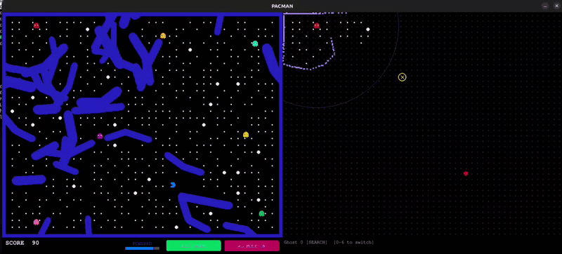

# PacmanBot

<p align="center">
  
</p>

Visit https://github.com/matharv07/minibot - to see a gazebo simulation of physical bots with routing logic playing pacman with all the same restrictions as laid down below.

This repo develops a PACMAN autonomous hive network, wherein the ghosts in the game communicate together and plan how to hunt down and eradicate the pacman. This acts as a proof of concept for developing a quadruped hive network for multi-agent reconnaissance missions.

---

## Technical Report

For a complete breakdown covering all engineering decisions, mathematical proofs, consensus rules, and performance ablations, check out the full technical report:

- **[Read the Full Technical Report (PDF)](report.pdf)**

---

## Game Modifications & Setup

There have been multiple modifications to the game to evaluate our system based on multi-agent collaborative metrics:

1. **Randomised Continuous Mazes:** Each new game has a procedurally generated maze-like structure so agents learn continuous navigation and exploration rather than memorising a single static grid route. The physics runs in continuous 2D space with capsule bounding hulls and continuous swept-path collision checks to prevent bots from tunneling through walls at high speeds.
2. **Win and Loss Conditions:** The game ends either when all pellets are consumed by the Pacman, or when the pacman is caught by one of the ghosts.
3. **Power Pellets and Inverted Phase:** Whenever a power pellet is consumed by the Pacman, it turns blue and can consume any of the ghosts. The ghosts' objective in that stage flips to evading getting eaten, since getting caught results in permanent death for the remainder of the round.
4. **Local Visibility and Radio Mesh:** There is no global notification of the powered stage. Ghosts in direct line of sight observe the state and update other ghosts via their internal communication network. Communication is constrained to a 12-meter radio radius, requiring messages to hop across intermediate ghosts when agents are spread out.
5. **Power Pellet Denial:** Ghosts can move over power pellets to consume or defend them, turning them into normal pellets so the pacman cannot use them. This sets up side tasks that ensure agent survival alongside the main task of hunting the pacman.
6. **Decentralised Task Allocation (CBBA):** Because direct communication is limited by distance, agents cannot rely on a central server. They run local auctions using the Consensus-Based Bundle Algorithm (CBBA) with 16 consensus rules to divide up roles (hunting, flanking, exploring, defending pellets) without stepping on each other's toes.
7. **Adversarial Evader:** The pacman is not a simple random agent. It uses topological pathfinding to actively flee pursuers, prioritising junctions with multiple open escape routes and avoiding dead-ends.

---

## How Everything Works

### Continuous Geometry & 16-Ray Steering (`world.py`, `ghost.py`)
The world is a continuous 2D plane $\mathbb{R}^2$. Obstacles and walls are generated using cellular automata and carved so at least 35% of the arena is guaranteed to be connected corridors. Each ghost has a 90-ray LiDAR sensor. To steer without getting stuck on walls or colliding into teammate bots, ghosts use 16-ray context steering: they build an interest map pointing toward their target waypoint, a danger map pointing at obstacles, and blend them with extra repulsion around other ghosts to avoid crowding narrow corridors.

### Decentralised Task Allocation (`cbba.py`, `allocator.py`)
To divide up work without a central server, the ghosts use CBBA:
- Each ghost bids on tasks based on marginal score and travel distance along the roadmap, with geometric temporal discounting ($\lambda = 0.95$).
- Tasks include direct hunting (`HUNT`), flanking escape corridors (`FLANK`), racing to defend power pellets (`CONVERT`), keeping safe surveillance distance during frightened mode (`EVADE_TRACK`), and searching unvisited areas (`EXPLORE`).
- When ghosts are within 12 meters of each other, they exchange winning bids and resolve disputes using the 16 deterministic conflict rules from Brunet et al.
- If a ghost gets outbid on a task in the middle of its bundle, it drops that task and all subsequent ones so it can rebid cleanly. If an agent goes silent or dies, peers detect the dropped heartbeat and re-auction its orphaned tasks.

### Bayesian Belief Map & Motion Predictor (`beliefmap.py`, `net.py`)
When the pacman breaks line of sight behind walls, the ghosts do not guess blindly. They maintain a 0.8m probability grid updated with directional anisotropic diffusion:
- Probability mass drifts in the direction the pacman was moving, repels away from where ghosts currently are, and gets pulled toward remaining pellet clusters.
- A 19-dimensional GRU recurrent network predicts the pacman's likely velocity vector based on recent trajectory history.
- Any probability mass that numerically bleeds into wall polygons gets pruned and redistributed back into walkable corridors using a softmax function so total probability always sums to 1.0.

### Pathfinding & Topological Evasion (`pathfinder.py`, `pacman.py`)
Navigation uses a Probabilistic Roadmap (PRM) saved in Compressed Sparse Row (CSR) format. When ghost LiDARs detect walls, intersecting edges get masked out dynamically using vectorized matrix operations in under 1 millisecond. When evading, pacman scores potential escape nodes by checking the distance gap between itself and the pursuers, giving heavy bonuses to nodes that have multiple corridor branches ($\text{deg} \ge 3$) and penalising blind cul-de-sacs.

### Neural Policy & Reward Shaping (`net.py`, `obs.py`, `reward.py`)
Ghost policies are trained using Multi-Agent PPO (MAPPO):
- **GhostActor:** Uses a ResNet convolutional stem that takes a 12-channel spatial map, modulated by a 70-dimensional kinematic vector using Feature-wise Linear Modulation (FiLM). A sequential categorical pointer head picks pairs of waypoints from local PRM candidates without replacement.
- **GhostCritic:** Centralized critic that evaluates global spatial tensors and all agent states during training.
- **Potential-Based Reward Shaping:** Dense rewards follow Ng et al. ($R = r_{\text{env}} + \gamma \Phi(s') - \Phi(s)$), guaranteeing that intermediate rewards cannot distort the optimal policy. The potential function combines distance to pacman, pincer angular encirclement ($1 - R$), communication graph connectivity, and corner trapping.

### Curriculum Learning & Multi-Worker Pipeline (`curriculum.py`, `train.py`, `worker.py`)
Training scales through four automated curriculum stages:
- Stage 1: $13 \times 17\,\text{m}$ arena with 2 ghosts against basic wandering pacman.
- Stage 2: $21 \times 27\,\text{m}$ arena with 5 ghosts and 2 power pellets.
- Stage 3: $27 \times 33\,\text{m}$ arena with 6 ghosts, 4 power pellets, and lead-margin evasion.
- Stage 4: $33 \times 41\,\text{m}$ full arena with 7 ghosts and intelligent topological fleeing.

Progression happens automatically once an 80% capture rate and episode return threshold are maintained over 100 episodes. The training engine runs 14 vectorized environments in parallel across separate CPU processes, feeding transitions to the GPU learner over multiprocessing pipes with zero-latency interrupts whenever a ghost sights the target.

---

## Setup & Installation

### Requirements
- Ubuntu 20.04 or 22.04 LTS (x86_64 or ARM64)
- Python 3.8+ (Strict requirement: `numpy==1.26.4`)
- NVIDIA GPU with CUDA recommended for training

### Install
```bash
git clone https://github.com/matharv07/pacmanbot.git
cd pacmanbot

python3 -m venv venv
source venv/bin/activate

pip install --upgrade pip
pip install numpy==1.26.4 torch torchvision scipy pygame opencv-python pyyaml requests pytest
```

---

## How to Run

### Training
```bash
#Start standard training across 14 parallel environments
python3 train.py

#Start directly at a specific curriculum stage
python3 train.py --stage 2 --num-envs 14 --batch-size 128 --lr 0.0003

#Resume from an existing checkpoint
python3 train.py --resume checkpoints/stage2_checkpoint.pt
```

### Evaluation & Visual Simulation
```bash
#Watch the trained agents play in a real-time Pygame window
python3 test.py --checkpoint checkpoints/best_model.pt --episodes 50 --render
```

### Running Tests
```bash
#Run integration smoke test
pytest tests/test_train_smoke.py -v

#Run movement and clearance monitor
python3 tests/monitor_ghost_moves.py
```

### Discord Training Updates
If you want live training metrics sent to Discord (kill rates, returns, loss, GPU memory), paste your webhook URL into `discord_webhook.txt`:
```bash
echo "https://discord.com/api/webhooks/YOUR_ID/YOUR_TOKEN" > discord_webhook.txt
```

---

## File Structure

- `world.py`            - Continuous 2D capsule physics, procedural maze generation, and PRM graph builder.
- `ghost.py`            - Ghost agent kinematics, 90-ray LiDAR sweeps, and 16-ray context steering.
- `pacman.py`           - Continuous pacman kinematics and topological flee decision engine.
- `cbba.py`             - Consensus-Based Bundle Algorithm auctioneer and 16-case Table 1 consensus rules.
- `allocator.py`        - Task definitions, marginal score bidding, and power pellet defense tasks.
- `beliefmap.py`        - 0.8m Bayesian spatial probability grid, anisotropic diffusion, and wall pruning.
- `pathfinder.py`       - CSR-backed A* graph search and dynamic wall edge masking.
- `net.py`              - GhostActor (FiLM ResNet), GhostCritic, and GRU opponent movement predictor.
- `obs.py`              - 12-channel spatial observation tensor and 70-dim kinematic feature vector.
- `reward.py`           - Potential-based reward shaping, pincer encirclement metric, and milestone rewards.
- `curriculum.py`       - 4-stage automated curriculum scheduler with transition and rollback logic.
- `worker.py`           - Simulation environment worker process and zero-latency sighting interrupts.
- `train.py`            - Distributed MAPPO learner across 14 environments with GAE and Discord telemetry.
- `test.py`             - Evaluation script and Pygame GUI visualizer.
- `report.pdf`          - Comprehensive 38-page technical engineering report covering continuous physics, CBBA proofs, and FiLM-MAPPO.
- `media/`              - Gameplay animation GIF (`gameplay.gif`) and video (`gameplay.mp4`).
- `tests/`              - Automated unit and regression test suites.

---

## Hardware Deployment

The continuous formulation was built to transition straight to physical bots without grid-snapping hacks:
- LiDAR ranges map to standard `sensor_msgs/LaserScan` ROS 2 topics.
- Commanded velocities $[v, \omega]$ map to `geometry_msgs/Twist` (`/cmd_vel`) topics for motor controllers.
- The 12-meter radio radius maps to physical ESP-NOW or Wi-Fi mesh networking.
- Check [`matharv07/minibot`](https://github.com/matharv07/minibot) for the corresponding Gazebo simulation.